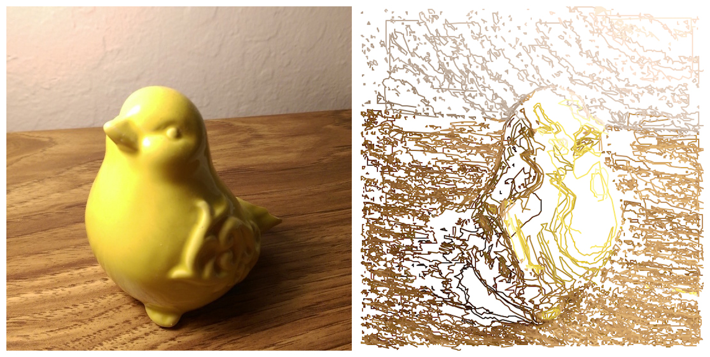
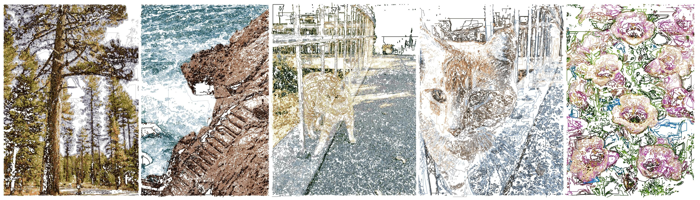
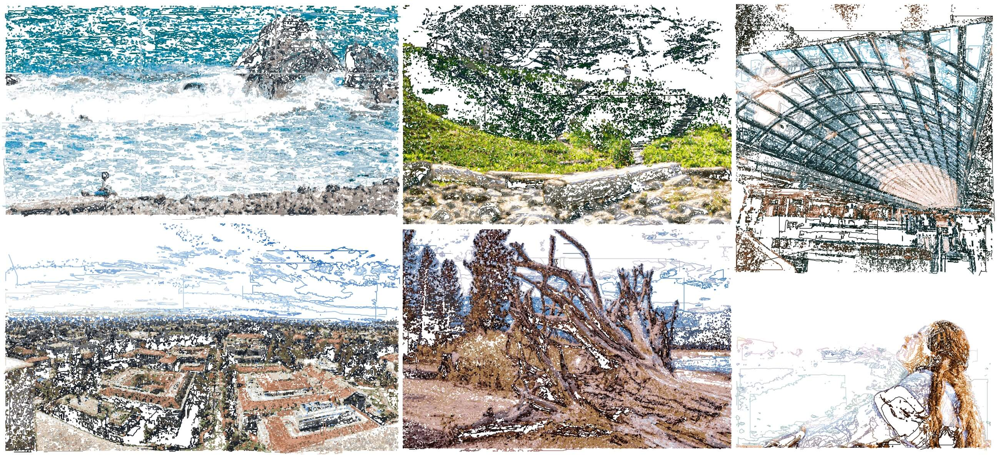
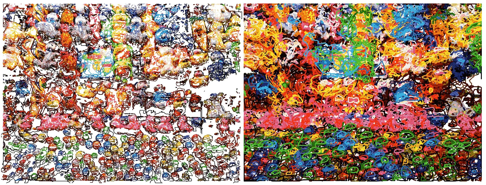

# `turtledraw`
Simple experiment: redrawing an arbitrary image using turtle graphics. Implemented in Fall 2016 in order to get students excited about Scheme recursive art. The idea was that I'd take a picture of the class and then let the turtle draw it (with my screen projected, so everyone could watch) over the course of the period.

Of course, it was never necessary to involve Scheme. In the interest of the general, non-Scheming population, I've added a version of the code that uses Python only. This is currently the standard version.

@TODO add GIF of turtle at work



## Setup
```
git clone https://github.com/ohjay/turtledraw.git
cd turtledraw
pip install -r requirements.txt
```

#### Requirements
- [Python](https://www.python.org/) (must be 3.4+ if the ability to save as PNG is desired)
- [NumPy](http://www.numpy.org/)
- [canvasvg](https://github.com/WojciechMula/canvas2svg)
- [CairoSVG](http://cairosvg.org/) (if Python 3)

Technically, everything can be run with Python 2.7 as well. However, images will be saved as SVGs instead of PNGs.

#### Troubleshooting
- `OSError: dlopen() failed to load a library: cairo / cairo-2`<br>
  Try running `brew install python3 cairo pango gdk-pixbuf libffi`.

## Usage
#### 1. To vectorize an image as an SVG file
Use this [online tool](https://www.vectorizer.io/). (_Do_ use this one; the code is meant to run with the SVG spec associated with this tool specifically.)

#### 2. To draw an SVG file using turtle graphics (no Scheme involved)
Modify the parameters at the top of `svgparse.py` as desired, then run
```
python3 svgparse.py <path_to_svg_file>
```

#### 2b. To convert an SVG file to Scheme turtle code
```
python3 svgparse.py --scheme <path_to_svg_file>
```

_Why Scheme?_ The original purpose of this project was to promote the Scheme recursive art contest. Accordingly, I meant to show people the kinds of things they could do with their personal Project 4 [Scheme] interpreters.

#### 3b. To run the Scheme turtle code
Run the file using the [Scheme interpreter](https://inst.eecs.berkeley.edu/~cs61a/sp17/proj/scheme/) from Berkeley's CS 61A (unfortunately, you'll have to implement this yourself; the project is reused every semester so I can't be posting the solution on GitHub). Note that my code does rely on having the 61A distribution of Scheme.

Alternatively, you can paste the generated code into Jen's [online interpreter](https://scheme.cs61a.org/).

## Examples
Many input images have been provided in the `in` folder as examples. Note: with the exception of `bird.jpg`, all `in/*.jpg` photographs were taken by [Tonya Nguyen](https://tonyanguyen.github.io/). (Also, speaking of `bird.jpg`, its redraw output looks a lot better if the `cubic_unfinished` parameter is set to `True`.)

##### _no Scheme_
```
cd turtledraw
python3 svgparse.py in/*.svg
```

##### _Scheme_
```
cd turtledraw
python3 svgparse.py --scheme in/*.svg
python3 scheme/scheme.py out/*.scm
```




The parameters can make a big difference in the style and quality of the output, as evidenced here:

